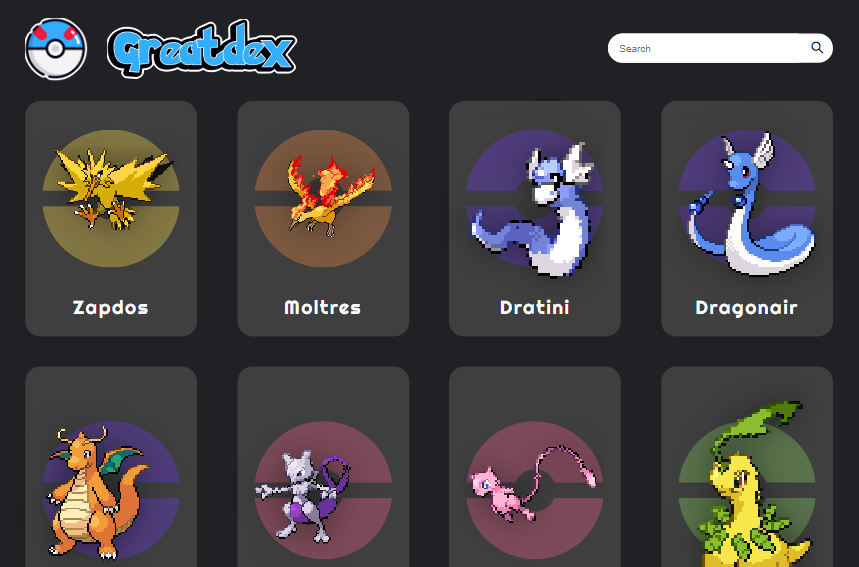
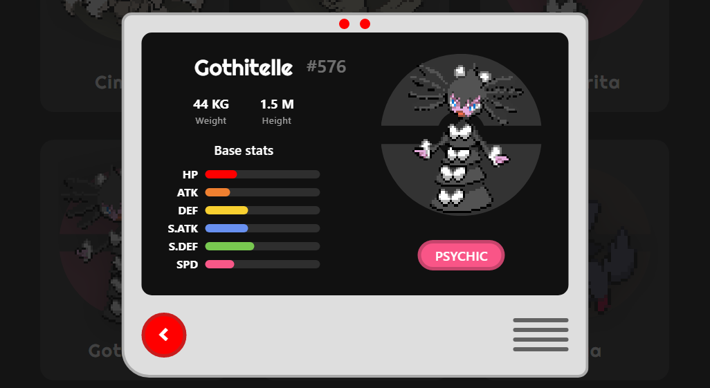

<div align="center">
⠀⠀
</br>
</br>
Pokedex interativa com todos os 913 pokémons inclusos!

[Web app](https://greatdex.vercel.app/)<br></br>
</div>

## 💻 Sobre

Este foi meu primeiro projeto utilizando o framework Angular! A aplicação consiste em uma <i>pokédex</i> interativa utilizando [PokeAPI](https://pokeapi.co/) para a requisição de todos os dados dos pokémons.

### Features

* <b>Listagem dos pokémons</b>
A página conta principalmente com uma grande lista de pokémons com seus sprites e nomes correspondentes.<br></br>
* <b>Lista paginada</b>
Para melhor navegação, a aplicação conta com um componente de paginação na área inferior da página.<br></br>
* <b>Sprites animados!</b>
Todas as imagens dos pokémons (até a 5ª geração) conta com sua versão animada na página de listagem.<br></br>
* <b>Sistema de busca</b>
Caso queira pesquisar por um pokémon específico, a aplicação também conta com um sistema de pesquisa (com autocomplete), que joga direto para o card de detalhes do pokémon selecionado.<br></br>
* <b>Detalhes</b>
O card exibe informações adicionais sobre o pokémon escolhido, como statísticas de combate, peso, altura, id e seus tipos.

</br>
</img>

## 📥 Instalação
1. Faça o download como ZIP clicando neste [link](https://github.com/C836/Greatdex/archive/refs/heads/main.zip) e extraia a pasta no local de sua preferência ou siga o passo a passo para fazer a instalação através do terminal do [Git:](https://git-scm.com/)

```bash
# Navegue pelos arquivos com o comando "cd" e faça o download do projeto
$ git clone https://github.com/C836/Greatdex.git

# Após o download, entre na pasta raiz da aplicação
$ cd Greatdex
```

2. Instale as dependências necessárias e inicie a aplicação.
```node
$ npm install
$ npm start 
```

## 🤖 Testes
A aplicação também conta com uma lista de testes unitários para verificar o funcionamento do projeto utilizando o test runner [Karma](https://karma-runner.github.io/latest/index.html) e o framework [Jasmine](https://jasmine.github.io/).

Para iniciar os testes utilize o seguinte comando em um terminal de sua escolha:
```node
$ npm test
```

#### Specs
- [x] Criação do componente principal
- [x] Verificação do título exibido na página
- [x] Criação do componente de pesquisa
- [x] Criação dos cards de pokémons
- [x] Criação do card de detalhes do pokémon
- [x] Verificação de resposta da API para cada componente

## 📝 Licença

<b>Copyright (c) 2022 Gabriel Lopes</b>

Esse projeto está sob a licença MIT. Veja o arquivo [LICENSE](https://github.com/C836/Greatdex/blob/main/LICENSE) para mais detalhes.